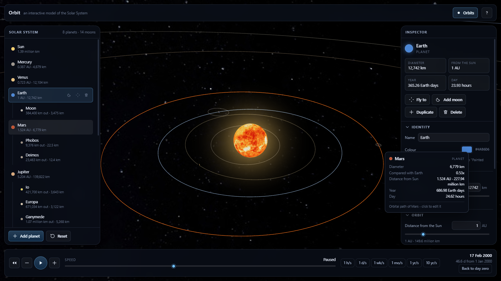
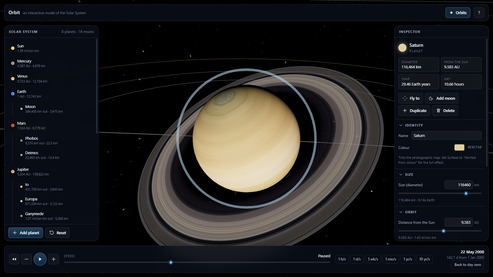
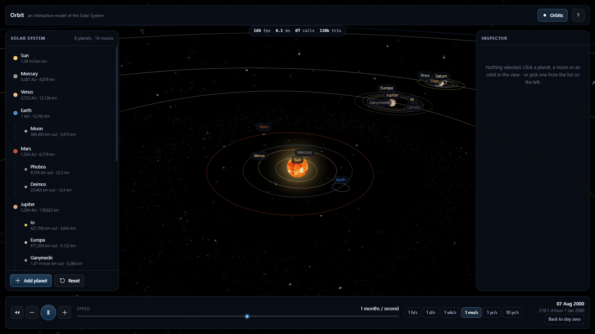

# Orbit 🌎

An interactive, proportionally scaled 3D model of the Solar System, built with
[Three.js](https://threejs.org/). Bend time, hover anything to read its numbers, and invent
planets and moons of your own.



Built for an after-school science club: the point is that a curious ten-year-old can drag a
slider and watch a world change, while the numbers underneath stay real.



---

## Contents

- [What it does](#what-it-does)
- [Quick start](#quick-start)
- [Full setup on a brand-new Windows computer](#full-setup-on-a-brand-new-windows-computer)
- [Troubleshooting on Windows](#troubleshooting-on-windows)
- [Using Orbit](#using-orbit)
- [How the scaling works](#how-the-scaling-works)
- [Bonus features and feature flags](#bonus-features-and-feature-flags)
- [Project structure](#project-structure)
- [npm scripts](#npm-scripts)
- [Requirements checklist](#requirements-checklist)
- [Credits and licence](#credits-and-licence)

---

## What it does

- **A real Solar System.** The Sun, eight planets and fourteen major moons, with radii, orbital
  distances, orbital periods, rotation periods, axial tilts and J2000 orbital elements taken from
  the NASA/JPL fact sheets. At simulation day 0 every planet is where it really was at noon on
  1 January 2000.
- **Real orbits, not circles.** Each body follows a Keplerian ellipse, so Mercury visibly speeds up
  at perihelion and Triton genuinely goes round Neptune backwards.
- **Time you control.** Start, stop, speed up, slow down, run backwards, jump back to day zero.
  Speed runs from half an hour to fifty-five years per second.
- **Full CRUD on planets and moons.** Add, edit and delete, with a slider *and* a typed input for
  every number: name, size, colour, orbital speed (year length), distance, spin, tilt, eccentricity,
  orbit tilt, surface and rings.
- **Hover for information.** Point at a planet *or at its orbital path* and a card appears with its
  name, diameter, size relative to Earth, distance from the Sun, year length and day length.
- **Light from the Sun.** A single point light inside the Sun lights everything from the right
  direction, giving every body a day/night terminator. Earth additionally reveals its city lights
  on the night side.
- **Real texture maps**, with procedurally painted surfaces for worlds you invent yourself, plus
  planetary spin, cloud shells, ring systems and atmospheres.
- **Your system is saved** in the browser, and can be exported to and imported from a JSON file.

---

## Quick start

If Node.js 20.19+ (22 LTS recommended) is already installed:

```powershell
npm install
npm run dev
```

Then open <http://localhost:5173> in Chrome, Edge or Firefox.

---

## Full setup on a brand-new Windows computer

These steps assume nothing is installed. Everything below runs in **PowerShell** or **Windows
Terminal** — press <kbd>Win</kbd> and type `powershell`, then press <kbd>Enter</kbd>.

### 1. Install Node.js

Node.js is the JavaScript runtime that builds and serves the project. Version **20.19 or newer** is
required; the current 22 LTS is recommended.

**Option A — winget (fastest, built into Windows 11):**

```powershell
winget install OpenJS.NodeJS.LTS
```

**Option B — the installer:** download the **LTS** Windows Installer (.msi) from
<https://nodejs.org/> and run it, accepting the defaults.

> After installing, **close the terminal and open a new one**. Windows only picks up the new `PATH`
> in newly opened terminals.

Check it worked:

```powershell
node --version
npm --version
```

You should see something like `v22.14.0` and `10.9.2`. If `node` is "not recognized", see
[Troubleshooting](#troubleshooting-on-windows).

### 2. Install Git (only if you are cloning the repository)

```powershell
winget install Git.Git
```

or download it from <https://git-scm.com/download/win>. Open a new terminal afterwards.

If you would rather not install Git, download the project as a ZIP from the repository page,
right-click it, choose **Extract All…**, and skip to step 4.

### 3. Get the code

```powershell
cd $HOME\Documents
git clone https://gitea.kood.tech/erichschneider/orbit.git
cd orbit
```

### 4. Install the dependencies

From inside the project folder (the one containing `package.json`):

```powershell
npm install
```

This downloads Three.js, Vite and ESLint into a local `node_modules` folder. It takes 10–30 seconds
on a normal connection and needs no administrator rights.

> The planet texture maps are already in `public/textures`, so **nothing else needs downloading** —
> Orbit runs fully offline after this step.

### 5. Run it

```powershell
npm run dev
```

The terminal prints:

```
  VITE v8.2.2  ready in 167 ms

  ➜  Local:   http://localhost:5173/
```

Open <http://localhost:5173/> in **Chrome, Edge or Firefox**. (Ctrl-click the link in Windows
Terminal to open it directly.)

Leave the terminal running while you use Orbit. Press <kbd>Ctrl</kbd>+<kbd>C</kbd> in it to stop the
server.

### 6. Optional: build the production version

```powershell
npm run build
npm run preview
```

`npm run build` writes a self-contained site into `dist/`, and `npm run preview` serves it at
<http://localhost:4173/>. The `dist` folder can be copied onto any static web host.

> `dist/index.html` cannot be opened directly from the file system: browsers refuse to load ES
> modules over `file://`. Always serve it, with `npm run preview` or any static server.

---

## Troubleshooting on Windows

**`npm` is not recognised as a command**
Node.js is not installed, or the terminal was open before it was installed. Close every terminal
window, open a new one, and try `node --version` again.

**`npm : File C:\Program Files\nodejs\npm.ps1 cannot be loaded because running scripts is disabled on this system`**
PowerShell's script policy is blocking npm. Allow local scripts for your own user (no admin rights
needed):

```powershell
Set-ExecutionPolicy -Scope CurrentUser -ExecutionPolicy RemoteSigned
```

Answer `Y`, then run `npm install` again. Alternatively, use `cmd.exe` instead of PowerShell, where
the policy does not apply.

**"Orbit could not start" or a black page with a message about hardware acceleration**
The browser cannot open a WebGL window. In Chrome or Edge open `chrome://settings/system` /
`edge://settings/system`, switch **Use graphics acceleration when available** on, and restart the
browser. On a laptop with two GPUs, make sure the browser is not forced onto the integrated chip
with acceleration disabled.

**Port 5173 is already in use**
Something else is on that port. Run the server on another one:

```powershell
npm run dev -- --port 5200
```

**`npm install` fails behind a school or company proxy**
Point npm at the proxy, then retry:

```powershell
npm config set proxy http://your.proxy:port
npm config set https-proxy http://your.proxy:port
```

**The planets are grey blobs instead of photographs**
The files in `public/textures` are missing (a partial download, or they were excluded by a
`.gitignore`). Fetch them again:

```powershell
npm run textures:fetch
```

Orbit deliberately does not break without them: any body whose texture is missing falls back to a
procedurally painted surface.

**Everything is slow on an old laptop**
Open the help dialog (**?** in the top right) and switch on **Adaptive quality** in the Bonus lab.
It trims render resolution automatically when the frame rate drops.

---

## Using Orbit

### The view

| Action | Result |
| --- | --- |
| Drag with the left mouse button | Turn the camera around the target |
| Scroll wheel | Zoom in and out |
| Drag with the right mouse button | Pan |
| Hover a planet, moon or orbit | Show its information card |
| Click a body | Select it and open it in the inspector |
| Double-click a row in the list | Fly the camera to that body |

### The panels

- **Left — Solar system.** Everything that exists, as a tree. Each row has a *fly to* button, a
  *delete* button, and — on planets — an *add moon* button. **Add planet** is at the bottom, next to
  **Reset**, which restores the real Solar System.
- **Right — Inspector.** Live editing of the selected body. Every numeric property has a slider and
  a typed box; changes apply as you drag. **Match Kepler's law** sets the year length that the
  current distance would really produce.
- **Bottom — Time.** Start/stop, halve/double the speed, run backwards, a logarithmic speed slider,
  named presets, and the simulated date.

### Keyboard

| Key | Action |
| --- | --- |
| <kbd>Space</kbd> | Start / stop time |
| <kbd>←</kbd> <kbd>→</kbd> | Slow down / speed up |
| <kbd>R</kbd> | Run time backwards |
| <kbd>A</kbd> | Add a planet |
| <kbd>F</kbd> | Fly to the selected body |
| <kbd>O</kbd> | Show or hide orbit paths |
| <kbd>Esc</kbd> | Clear the selection |
| <kbd>Del</kbd> | Delete the selected body (with an undo option) |
| <kbd>?</kbd> | Help, shortcuts and the Bonus lab |

### Saving

Your system saves itself in the browser as you work. **Export as JSON** and **Import JSON** in the
help dialog move a system between computers. **Reset** restores the real Solar System and clears the
saved copy.

---

## How the scaling works

The Solar System is mostly empty space. On one shared linear scale, a scene wide enough to hold
Neptune would draw Earth about two thousandths of a pixel across — which is why Orbit uses separate
linear scales for distance and for size. All of this lives in one file, `src/config/scale.js`:

| Quantity | Scale | Result |
| --- | --- | --- |
| Orbital distance | 1 AU → 100 units | Earth 100, Jupiter 520, Neptune 3007 |
| Planet & moon radius | 5 800 km → 1 unit | Earth 1.10, Jupiter 12.05, Mercury 0.42 |
| Sun radius | 36 000 km → 1 unit | Sun 19.3 — bigger than Jupiter, clear of Mercury's orbit |

Because each family shares a single linear factor, **proportions inside each family are exact**:
Jupiter really is 11.2× Earth's width here, and Neptune really is 30× further out than Earth.

Moons get one extra step. Our Moon sits 60 Earth radii away; Io sits 6 Jupiter radii away. Scaling
both linearly would bury Io inside a Jupiter drawn twelve units wide. Orbit therefore measures a
moon's orbit in *planet radii* and compresses that ratio along a gentle power curve with a floor of
1.8 planet radii. Every moon stays outside its planet and outside its rings, and the ordering inside
each system is preserved — Io is still closer than Europa, which is still closer than Ganymede.

**True-scale mode** (in the Bonus lab) throws all of that away and puts sizes, distances and moon
orbits on one honest linear scale. The planets become specks. That is the point.

---

## Bonus features and feature flags

Bonus functionality is kept strictly separate from the core requirements. Nothing in `src/` outside
`src/bonus/` reads a bonus flag, no bonus module is even constructed until its flag is switched on,
and **every flag defaults to off** — so the default behaviour is exactly the mandatory behaviour.

Switch them on in the **Bonus lab** section of the help dialog (**?**), or from the address bar:

```
http://localhost:5173/?bonus=labels,trails
http://localhost:5173/?bonus=all
http://localhost:5173/?bonus=none
```

| Flag | What it adds |
| --- | --- |
| `labels` | A name chip pinned to every body |
| `trails` | Fading comet-style trails behind every orbiting body |
| `asteroidBelt` | 2 400 rocks between Mars and Jupiter as a screen-space point cloud, one draw call |
| `trueScale` | Rescales sizes and distances onto one honest linear scale |
| `shadows` | Real cast shadows from the Sun — watch for an eclipse |
| `stats` | Live FPS, frame time, draw calls and triangle count |
| `autoQuality` | Drops render resolution automatically if the frame rate sags |
| `screenshot` | A camera button that saves the current view as a PNG |

They are also reachable from the browser console: `orbit.flags.set('trails', true)`.



---

## Project structure

```
orbit/
├─ index.html                 the page shell and the loading screen
├─ vite.config.js             dev server and build configuration
├─ eslint.config.js
├─ scripts/fetch-textures.mjs re-downloads the texture maps
├─ public/textures/           planet, moon, ring and sky maps (CC BY 4.0)
└─ src/
   ├─ main.js                 boot, WebGL check, friendly failure
   ├─ App.js                  composition root: wires everything, owns the frame loop
   ├─ config/
   │  ├─ scale.js             every real-units → scene-units conversion
   │  └─ featureFlags.js      bonus flags: URL, localStorage, UI
   ├─ core/
   │  ├─ SceneManager.js      renderer, camera, controls, lighting, render loop
   │  ├─ SimulationClock.js   simulated time and its speed
   │  └─ OrbitTrack.js        Kepler's equation and the orbital ellipse
   ├─ data/solarSystem.js     the real Solar System, in real units
   ├─ state/
   │  ├─ SystemStore.js       the single source of truth + CRUD events
   │  ├─ bodySchema.js        normalisation, limits, templates, Kepler helpers
   │  └─ persistence.js       autosave, export, import
   ├─ objects/
   │  ├─ SolarSystemView.js   store → Three.js scene graph
   │  ├─ BodyView.js          one body: sphere, clouds, rings, atmosphere, marker
   │  ├─ OrbitPathView.js     the ellipse, plus the invisible tube that makes it hoverable
   │  └─ materials.js         surface tinting and the day/night shader patch
   ├─ textures/
   │  ├─ catalogue.js         which file belongs to which body
   │  ├─ TextureLibrary.js    loading, caching and the idle paint queue
   │  └─ procedural.js        the procedural planet painter
   ├─ interaction/Picker.js   pointer → body or orbit under the cursor
   ├─ ui/                     panels, inspector, time bar, tooltip, dialogs, styles
   ├─ utils/                  maths, colour, seeded noise, number formatting
   └─ bonus/                  every optional extra, behind a flag
```

The data flow is deliberately one-way:

```
UI action ──▶ SystemStore ──▶ 'add' | 'update' | 'remove' event ──▶ SolarSystemView ──▶ Three.js
```

The store never imports Three.js, and the 3D layer never writes to the store. That is why "add a
planet" is a three-line operation.

---

## npm scripts

| Command | What it does |
| --- | --- |
| `npm run dev` | Start the development server at <http://localhost:5173> |
| `npm run build` | Build the production site into `dist/` |
| `npm run preview` | Serve the built site at <http://localhost:4173> |
| `npm run lint` | Run ESLint over the whole project |
| `npm run textures:fetch` | Re-download the texture maps (add `-- --force` to overwrite) |

---

## Requirements checklist

**Mandatory**

| Requirement | Where |
| --- | --- |
| 3D Solar System using Three.js | `src/core/SceneManager.js`, `src/objects/*` |
| Scene with camera, lighting and renderer | `SceneManager` — perspective camera, point light inside the Sun + ambient fill, WebGL renderer with a logarithmic depth buffer |
| Planets and Sun modelled with geometries and materials | `BodyView` — one shared sphere geometry, `MeshStandardMaterial` for lit bodies, `MeshBasicMaterial` for the Sun |
| Sizes and distances scaled proportionally | `src/config/scale.js`, documented above |
| Each planet orbits with an animated orbital path | `OrbitTrack` (Kepler) + `OrbitPathView` (the drawn ellipse) |
| Start, stop, speed up, slow down | `src/core/SimulationClock.js`, `src/ui/TimeBar.js`, keyboard shortcuts |
| Add, edit and delete planets with intuitive controls | `src/ui/BodyTree.js`, `src/ui/Inspector.js`, `SystemStore` |
| Name, size, colour, orbital speed, distance configurable | `Inspector` — slider **and** typed input for each |
| Hover a planet *or its orbit* for name, size and distance | `src/interaction/Picker.js`, `src/ui/Tooltip.js` |
| Lighting creates day/night effects | Point light at the Sun; `applyDayNight` adds Earth's city lights on the night side |
| No runtime errors or console warnings | Verified in Chrome: clean console through start-up, hovering, CRUD, every bonus flag, and an 83-body stress test |

**Extra**

| Requirement | Where |
| --- | --- |
| Moons orbit their planets, with full CRUD and properties | `moonTemplate`, `Inspector`, `scale.moonOrbitRadius`; 14 real moons ship by default |
| Realistic textures, with planetary spin | `src/textures/*`; real maps for the Sun, all eight planets and the Moon, procedural surfaces for invented worlds, rotation driven by each body's real rotation period |
| Smooth performance with added bodies | One shared sphere geometry, reference-counted texture cache, an idle queue for procedural painting, debounced repaints, in-place DOM updates while dragging; 83 bodies render at over 100 fps on a laptop GPU |
| Polished, responsive interaction | Damped camera, one raycast per frame at most, debounced autosave, undo on delete, full keyboard support, responsive layout down to phone width |
| Bonus clearly separated from core | `src/bonus/` + `src/config/featureFlags.js`, all off by default |

---

## Credits and licence

- **Texture maps** — [Solar System Scope](https://www.solarsystemscope.com/textures/), licensed
  [CC BY 4.0](https://creativecommons.org/licenses/by/4.0/), based on NASA elevation and imagery
  data. Full attribution in [`public/textures/CREDITS.md`](public/textures/CREDITS.md).
- **Physical and orbital data** — NASA/JPL planetary fact sheets and the JPL "Approximate Positions
  of the Major Planets" tables.
- **Rendering** — [three.js](https://threejs.org/).
- **Code** — MIT, see [LICENSE](LICENSE).
